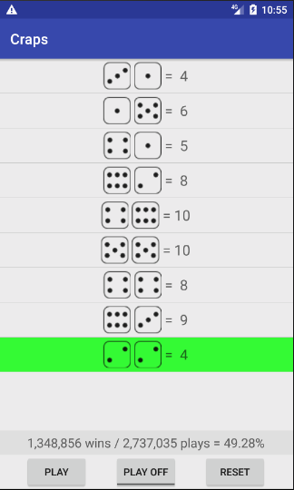

# Android Craps Simulator

We created an app that simulates the game of Craps on your phone. The app contains
2 imported dice images, a play button, reset button and a playOn/playOff button. the 
playOn/playOff features a Monte Carlo simulation allowing you to look ahead 
100,000 plays giving you an accurate depiction of the odds. For the users convenience we
utilized Androids color options to make it clear whether you have won or lost.
green was established as a win while red signifies a loss. 

####App Features
  1. Monte Carlo simulation for odds calculations.
  2. Android color utilization to help determine whether you have won or lost.
  3. Dice Images to enhance the gaming experience.
  4. Simple design with wins/plays/percentage features 
  

